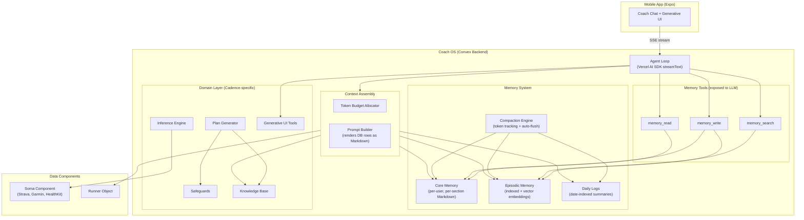

# Coach OS Architecture Plan

## Design Decisions

- **Full Convex-native**: No external orchestration platform (not OpenClaw, not Letta). The "OS kernel" is Convex mutations/actions + Vercel AI SDK.
- **Per-user agents as database rows**: Each user's agent state, memory, and conversation live as rows indexed by `userId`. No agent process running per user -- the agent materializes from DB state on each interaction.
- **Markdown-in-database**: Memory content fields store free-form Markdown strings for LLM-native richness. Structured metadata fields (timestamps, tags, sections) enable queryability. Best of both worlds.
- **Letta-inspired agentic memory**: The agent manages its own memory via tool calls (`memory_read`, `memory_write`, `memory_search`). The LLM decides what to remember.
- **OpenClaw-inspired compaction**: Auto-compaction with pre-compaction memory flush when token threshold is crossed. Transparent to the user.
- **Componentization**: The memory system (`@nativesquare/agent-memory`) is designed as a potential Convex component from the start, with clean boundaries separating generic memory infrastructure from Cadence-specific domain logic.

## Architecture Overview



---

## How It All Comes Together: The Assembled Prompt

This is the critical section -- what the LLM literally **sees** when a user sends a message. The Context Assembly pipeline (Phase 3) pulls from two parallel data systems and merges them into a single system prompt:

- **Runner Object** (Cadence-specific, structured data) -- facts collected during onboarding and updated from wearable syncs. Typed fields like `experienceLevel`, `easyPace`, `goalType`. Used by Plan Generator, Inference Engine, Safeguards. Queryable.
- **Memory System** (generic, interaction-deduced, qualitative) -- insights the LLM discovers through conversation. Things like "gets anxious before long runs" or "the 1% framing resonates." Self-managed by the agent via tool calls. Rich Markdown text.

They serve different purposes, are managed by different systems, and are stored separately -- but they're **combined at inference time** into a single context that makes the coach feel deeply human.

### Example: What the LLM Receives

When Alex sends "Hey coach, I'm thinking about skipping my long run tomorrow", the full system prompt assembled from database state looks like:

```
# SYSTEM PROMPT

You are Coach — a warm, knowledgeable AI running coach. You deeply understand
this runner and adapt your approach based on everything you know about them.

## Tool Usage
- Use memory_write to save important insights you discover about this runner
- Use memory_read to recall specific past context
- Use memory_search to find relevant past episodes
- Use renderMultipleChoice, renderConfirmation, etc. for structured interactions

## Conversation Rules
1. Reference what you know about this runner naturally — don't list facts
2. One topic at a time
3. Acknowledge first, then advise

---
                                                          ┌─────────────────────┐
## Runner Profile                                         │ SOURCE: Runner      │
- Name: Alex (confirmed)                                  │ Object (structured  │
- Experience: Intermediate (2 years running)              │ Convex table)       │
- Current volume: 45 km/week across 5 sessions            │                     │
- Easy pace: 5:30/km                                      │ Rendered as Markdown│
- Goal: Half marathon in 1:30:00, race date April 19      │ by context assembly │
- Schedule: 5 days/week, mornings, Tuesdays blocked       │                     │
- Injuries: History of shin splints (resolved 6mo ago)    │ Also feeds into:    │
- Recovery style: Moderate                                │ Plan Generator,     │
- Coaching voice: Encouraging                             │ Safeguards,         │
- Connected devices: Garmin Forerunner 265                │ Inference Engine    │
                                                          └─────────────────────┘

                                                          ┌─────────────────────┐
## Core Memory                                            │ SOURCE: coreMemory  │
                                                          │ table (Markdown     │
### Coaching Insights                                     │ strings per section)│
- Alex gets anxious before long runs over 15km —          │                     │
  reframe as "exploration runs"                           │ Written by the LLM  │
- Responds poorly to comparisons with other runners       │ itself via          │
- When stressed at work (happens ~monthly), drops from    │ memory_write tool   │
  5 to 3 runs/week — don't push, acknowledge it           │ calls               │
- Prefers to know the "why" behind training decisions     │                     │
                                                          │ This is the agent's │
### What's Working                                        │ personal notepad —  │
- Short-term weekly goals motivate more than distant      │ qualitative,        │
  race targets                                            │ nuanced, things     │
- Loves HR zone breakdowns after runs — always include    │ that don't fit in   │
- The "1% better" framing resonates strongly              │ structured fields   │
- Specific next-step action items work better than        │                     │
  open-ended encouragement                               └─────────────────────┘

### Recent Context
- Started new job Feb 2026, still adjusting schedule
- 2-week streak of hitting all sessions — longest yet
- Wants to try trail running after the half marathon

                                                          ┌─────────────────────┐
## Yesterday — March 7                                    │ SOURCE: dailyLogs   │
- Completed easy 8km recovery run in 45:12 (5:39/km)     │ table (date-indexed)│
  — slightly faster than prescribed, HR stayed in Z2      │                     │
- Sleep score from Garmin: 78 (fair, went to bed late)    │ Today + yesterday   │
- Body Battery at wake: 45 (below typical 60-70 range)    │ always loaded       │
- Asked about nutrition before long runs for first time   │                     │
- Seemed enthusiastic about tomorrow's 16km long run      │ Auto-generated by   │
                                                          │ daily cron job OR   │
## Today — March 8                                        │ written during      │
- Scheduled session: 16km long run at 5:40-5:50/km       │ compaction          │
- No interaction yet today                                └─────────────────────┘
- Body Battery at wake: 52 (recovering but below baseline)

                                                          ┌─────────────────────┐
## Relevant Past Episodes                                 │ SOURCE:             │
- [Feb 22] Skipped a 14km long run due to work stress.    │ episodicMemory      │
  Felt guilty. Coach reframed as "your body needed it"    │ table (vector       │
  — Alex responded positively, came back strong.          │ search)             │
- [Feb 8] First long run over 15km (16km). Was anxious,   │                     │
  messaged "not sure I can do this." Completed in 1:32.   │ Retrieved via       │
  Called it "the best run of my life."                    │ semantic search     │
- [Jan 28] Shin pain flared after increasing volume too   │ using the user's    │
  fast. Backed off 3 days.                                │ current message as  │
  Importance: watch for shin symptoms when volume is up.  │ the query           │
                                                          └─────────────────────┘
---

## Conversation History                              (from existing messages table)

[assistant] Great work on yesterday's recovery run! Your pace was right
in the sweet spot. How are you feeling heading into the weekend?

[user] Hey coach, I'm thinking about skipping my long run tomorrow
```

### Why This Works

The LLM now has everything it needs for a deeply personalized response:

- From **Runner Profile** (structured): knows the half marathon is April 19 (6 weeks out), this is a 16km long run at prescribed pace
- From **Core Memory** (qualitative): knows Alex gets anxious before long runs over 15km, knows to reframe rather than push, knows not to guilt-trip about skipped sessions
- From **Daily Logs** (temporal): sees Body Battery is 52 (below baseline), sleep was poor -- there's a legitimate recovery reason
- From **Episodic Memory** (semantic search): recalls the Feb 22 skip where reframing worked, and the Feb 8 anxiety-then-triumph pattern

A likely response:

> "No pressure at all. Your body's been working hard -- two solid weeks of hitting every session is your longest streak, that's real progress. Your Garmin is showing you're still recovering from the last few days. What's making you think about skipping -- feeling tired, or something else going on?"

That response uses core memory (don't push, acknowledge streaks), daily logs (Body Battery data), and episodic memory (the reframing pattern) -- without ever exposing that it's reading from a database. The Runner Profile gives the **facts**. The Memory gives the **understanding**. Together they make the coach feel human.

### The Two Data Systems: Side by Side

```
Runner Object (Cadence-specific)          Memory System (generic component)
================================          ==================================
Structured typed fields                   Free-form Markdown strings
Collected during onboarding               Discovered through conversation
Updated from wearable syncs (Soma)        Self-managed by the LLM via tools
Queryable: runner.goals.raceDistance      Searchable: vector embeddings
Feeds Plan Generator + Safeguards         Feeds context assembly only
Example: experienceLevel: "intermediate"  Example: "Alex calls himself a
                                           beginner despite 2 years — respect
                                           that self-perception"
```

Both are loaded at inference time. Neither replaces the other. The Runner Object would say `pastInjuries: ["shin splints"]`. The Core Memory would say "watch for shin pain when volume increases -- happened Jan 28, backed off 3 days, responded well to conservative approach."

---

## Phase 1: Memory System Schema and CRUD

New tables in `[packages/backend/convex/schema.ts](packages/backend/convex/schema.ts)`. These sit alongside the existing `conversations` and `messages` tables.

### Tables

`**coreMemory**` -- The agent's self-managed notepad (Letta's "in-context memory"). Always loaded into context. Agent edits it via tool calls.

- `userId: v.id("users")` -- one core memory per user
- `section: v.string()` -- e.g., "preferences", "health_context", "coaching_strategies", "key_facts"
- `content: v.string()` -- free-form Markdown (the rich text)
- `updatedAt: v.number()`
- `version: v.number()` -- incremented on each edit for audit
- Index: `by_userId_section: ["userId", "section"]`

`**episodicMemory**` -- Specific past events and interactions (Letta's "archival memory"). Searched on demand via embeddings.

- `userId: v.id("users")`
- `content: v.string()` -- Markdown summary of the episode
- `tags: v.array(v.string())` -- e.g., ["injury", "milestone", "plan_change"]
- `importance: v.number()` -- 0-1 relevance score (set by agent)
- `embedding: v.optional(v.array(v.float64()))` -- for vector search
- `sourceConversationId: v.optional(v.id("conversations"))`
- `createdAt: v.number()`
- Index: `by_userId: ["userId"]`, `by_userId_importance: ["userId", "importance"]`
- Vector index on `embedding`

`**dailyLogs**` -- Append-only daily summaries (OpenClaw's `memory/YYYY-MM-DD.md`). Today + yesterday loaded at session start.

- `userId: v.id("users")`
- `date: v.string()` -- "2026-03-08" format
- `content: v.string()` -- Markdown summary of the day
- `metrics: v.optional(v.object({...}))` -- structured daily snapshot (sleep score, volume, etc.)
- `createdAt: v.number()`
- `updatedAt: v.number()`
- Index: `by_userId_date: ["userId", "date"]`

`**agentState**` -- Per-user agent metadata for compaction and lifecycle tracking.

- `userId: v.id("users")`
- `totalTokensUsed: v.number()` -- running token count for current conversation
- `compactionCount: v.number()` -- how many times compaction has fired
- `lastCompactionAt: v.optional(v.number())`
- `lastInteractionAt: v.number()`
- `memoryVersion: v.number()` -- global version for the user's memory
- Index: `by_userId: ["userId"]`

### CRUD Functions

- `memory.getCoreMemory({ userId })` -- returns all core memory sections for a user
- `memory.writeCoreMemory({ userId, section, content })` -- upsert a section (used by agent tool)
- `memory.addEpisode({ userId, content, tags, importance })` -- insert + generate embedding
- `memory.searchEpisodes({ userId, query, limit })` -- vector search over episodic memory
- `memory.getDailyLog({ userId, date })` -- get a specific day's log
- `memory.writeDailyLog({ userId, date, content, metrics })` -- upsert daily log
- `memory.getAgentState({ userId })` -- get compaction/lifecycle state
- `memory.updateTokenCount({ userId, tokens })` -- increment token tracker

---

## Phase 2: Memory Tools (LLM-facing)

These are AI SDK tools exposed to the LLM, added to the existing tools in `[packages/backend/convex/ai/tools/index.ts](packages/backend/convex/ai/tools/index.ts)`. The agent calls these autonomously during conversation.

- `**memory_read**`: Read a specific core memory section or search episodic memory. Parameters: `{ type: "core" | "episodic", section?: string, query?: string, limit?: number }`.
- `**memory_write**`: Write to core memory (replace a section) or create an episodic memory. Parameters: `{ type: "core" | "episodic", section?: string, content: string, tags?: string[], importance?: number }`.
- `**memory_search**`: Semantic search over all memory (episodic + daily logs). Parameters: `{ query: string, limit?: number }`. Returns ranked results with content snippets.

The system prompt instructs the agent when and how to use these tools. Key instruction: "When you learn something important about the user that you'd want to remember next session, use `memory_write` to persist it."

---

## Phase 3: Context Assembly Pipeline

A new module at `packages/backend/convex/ai/context.ts` that builds the LLM prompt from database state.

### Token Budget Allocation

```
Total budget: ~10,000 tokens (configurable)
├── System prompt (persona + rules):       ~800 tokens
├── Core memory (all sections):            ~2,000 tokens
├── Daily logs (today + yesterday):        ~1,000 tokens
├── Episodic memory (top-K relevant):      ~1,500 tokens
├── Runner profile (structured snapshot):  ~500 tokens
├── Knowledge Base (RAG if needed):        ~1,000 tokens
├── Conversation history (recent turns):   ~2,000 tokens
└── Response reserve:                      ~1,200 tokens
```

### `assembleContext({ userId, currentMessage })` function

1. Load core memory sections, render as Markdown
2. Load today's + yesterday's daily logs
3. Semantic search episodic memory using `currentMessage` as query
4. Load runner profile from Runner Object, render as Markdown
5. Optionally query Knowledge Base if the message is about training science
6. Load recent conversation messages (newest N that fit budget)
7. Apply token budget -- rank and trim if over budget
8. Return assembled system prompt string

This replaces the current `[buildSystemPrompt()](packages/backend/convex/ai/prompts/onboarding_coach.ts)` with a much richer context-aware version.

---

## Phase 4: Compaction Engine

A Convex action triggered when `agentState.totalTokensUsed` crosses a configurable threshold (e.g., 80% of model's context window).

### Compaction Lifecycle (inspired by OpenClaw)

1. **Detect**: After each agent response, update `totalTokensUsed` in `agentState`. If it crosses the threshold, schedule compaction.
2. **Memory Flush Turn**: Run a silent agent turn (user doesn't see it) with a special system prompt: "You are about to lose older context. Review the conversation and save anything important using `memory_write`. Update your core memory sections. Create episodic memories for significant events."
3. **Summarize**: Generate a summary of the conversation so far (a condensed Markdown paragraph).
4. **Persist**: Write the summary to today's `dailyLog`. Ensure all important facts are in core/episodic memory.
5. **Compact**: Delete old messages from the `messages` table (or mark as archived), keeping only the summary + the most recent N turns.
6. **Reset**: Reset `agentState.totalTokensUsed`. Increment `compactionCount`.

### Daily Log Generation

A Convex cron job runs at end of day (or on first interaction of a new day):

- Summarize yesterday's interactions into a `dailyLog` entry
- Update core memory if patterns emerged ("User ran 3 times this week, up from 2")
- Prune old daily logs beyond retention window (e.g., 30 days of full logs, older ones get further summarized)

---

## Phase 5: Agent Loop Refactor

Refactor the existing `[streamChat](packages/backend/convex/ai/http_action.ts)` to use the full Coach OS architecture.

### Current Flow

```
User message → buildSystemPrompt(runner) → streamText(GPT-4o) → stream response
```

### New Flow

```
User message → getAgentState(userId)
             → assembleContext(userId, message)  // Phase 3 pipeline
             → streamText(model, { system, messages, tools })
             → onStepFinish: handle memory_write tool calls
             → updateTokenCount(userId, tokensUsed)
             → if overThreshold: scheduleCompaction(userId)  // Phase 4
             → stream response to client
```

The agent loop remains Vercel AI SDK `streamText` -- no framework on top. The Coach OS is the memory + context + compaction infrastructure around it.

---

## Phase 6: System Prompt Evolution

Evolve the system prompt from the current onboarding-only prompt to a full Coach OS prompt that:

- Includes memory tool usage instructions
- Adapts persona based on coaching stage (onboarding vs. active training vs. race week)
- References the user's core memory naturally
- Instructs when to write vs. read memory
- Handles the memory flush turn gracefully

---

## Integration Points with Existing Systems

| Existing System              | Integration                                                                                   |
| ---------------------------- | --------------------------------------------------------------------------------------------- |
| **Soma** (wearable data)     | Inference Engine reads from Soma, writes derived metrics to daily logs and core memory        |
| **Runner Object**            | Rendered as structured Markdown in context assembly. Agent updates it via existing mutations. |
| **Safeguards**               | Checked during plan generation and when agent recommends training changes                     |
| **Knowledge Base**           | RAG retrieval during context assembly when query is about training science                    |
| **Conversations + Messages** | Existing tables continue to store raw conversation. Compaction archives old messages.         |
| **Generative UI Tools**      | Existing tools (`renderMultipleChoice`, etc.) work unchanged alongside new memory tools       |

---

## File Map

| File                            | Purpose                                                              |
| ------------------------------- | -------------------------------------------------------------------- |
| `convex/schema.ts`              | Add `coreMemory`, `episodicMemory`, `dailyLogs`, `agentState` tables |
| `convex/memory/core.ts`         | Core memory CRUD (read, write, upsert sections)                      |
| `convex/memory/episodic.ts`     | Episodic memory CRUD + vector search                                 |
| `convex/memory/daily.ts`        | Daily log CRUD + generation                                          |
| `convex/memory/state.ts`        | Agent state tracking (tokens, compaction count)                      |
| `convex/ai/tools/memory.ts`     | LLM-facing memory tools (memory_read, memory_write, memory_search)   |
| `convex/ai/context.ts`          | Context assembly pipeline with token budgeting                       |
| `convex/ai/compaction.ts`       | Compaction engine (detect, flush, summarize, compact)                |
| `convex/ai/prompts/coach_os.ts` | Evolved system prompt with memory instructions                       |
| `convex/ai/http_action.ts`      | Refactored agent loop with memory + compaction                       |
| `convex/crons.ts`               | Daily log generation cron job                                        |
