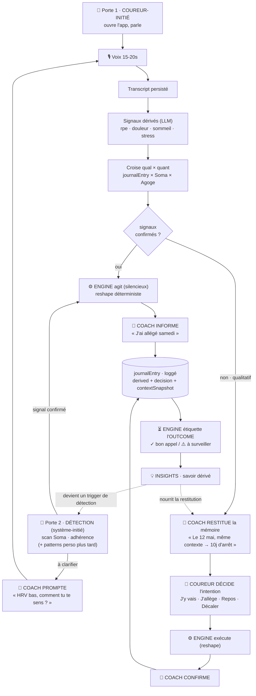

# Cadence — Le Wedge : Brief d'équipe (mini-BP)

> **À qui s'adresse ce document.** Toute l'équipe. La **Partie 1** (Pourquoi / Qui / Quoi) se lit sans bagage technique. La **Partie 2** (Comment) décrit la matérialisation technique. Le spec d'implémentation détaillé vit dans [`docs/wedge-mvp-spec.md`](./wedge-mvp-spec.md) ; ce document-ci est la référence partagée.
>
> **Source** : analyse du marché FR ([`docs/Research Report.pdf`](./Research%20Report.pdf)) + décisions de design prises en équipe.

---

## TL;DR (une page)

**Le wedge de Cadence n'est pas « un meilleur plan ». C'est deux choses que personne ne fait : voir l'athlète en entier, et apprendre de lui en continu.**

Le marché du running a saturé trois couches : générer un plan, prescrire des allures, tracker la montre. Tout le monde fait ça (Runna, Campus Coach, Kiprun, RunMotion, Garmin…). Cadence ajoute la quatrième, en **deux mouvements** :

- **Wedge 1 — Voir plus large (la largeur).** Croiser les données de santé abondantes de la montre avec ce qu'elle ne capte pas — le ressenti, les aléas de la vie, les peurs, l'état mental du coureur. Une vision **holistique** de l'athlète, là où les autres ne voient que des chiffres. → c'est la **différenciation** : pourquoi Cadence est meilleure _dès aujourd'hui_.
- **Wedge 2 — Comprendre toujours mieux (la profondeur).** Mémoriser les décisions et leurs résultats pour que cette compréhension **s'affine avec le temps** — d'abord pour que le coach **décide mieux** ; ce qu'on en surface au coureur (il en apprend sur lui) n'est que la part visible. La qualité du coaching grandit avec le coureur. → c'est la **douve** : pourquoi Cadence _reste devant_ (un concurrent qui débarque a zéro historique sur ce coureur).

Wedge 2 a besoin de Wedge 1 : on ne peut apprendre que d'une donnée riche. Le Wedge 1 sans le 2 reste une belle photo ; avec, il devient une connaissance vivante.

- **Qui** : le marathonien français équipé d'une montre GPS — du primo-marathonien au coureur confirmé visant un bon chrono (jusqu'à ~2h45), 25-45 ans, motivé par l'accomplissement et le bien-être, inquiet de la blessure. Segment large (~146 000 finishers de marathon/an en France, 51 % de primo-marathoniens à Paris), à forte composante féminine.
- **Le besoin** : pas un plan de plus (il en existe des gratuits et des payants à foison). Une **aide à la décision** quand le corps et la vie ne suivent pas le plan (« j'y vais / j'allège / je repose ? »), et une **mémoire** de ses propres apprentissages — aujourd'hui bricolés au carnet, au Google Sheet et à « la petite voix intérieure ».
- **Pourquoi maintenant** : boom du premier marathon + défiance naissante envers les plans algorithmiques trop agressifs (épisode Runna/WSJ) + ubiquité des montres GPS (la donnée quantitative est abondante, le qualitatif criant d'absence).
- **La promesse** : _« Ce que ta montre ne voit pas, Cadence l'écoute. Et s'en souvient. »_ _(backups en fin de doc)_

---

# PARTIE 1 — Le Pourquoi, le Qui, le Quoi

## 1. Le constat marché

Le running FR est **grand, mature, en croissance — et déjà équipé** :

- **12,4 M** de pratiquants (25 % de la population), dont ~8 M réguliers.
- **49 %** de femmes ; **70 %** des nouveaux entrants (< 5 ans de pratique) sont des femmes — le flux d'entrée est féminin.
- Motivation dominante : **bien-être** (santé 59 %, bien dans son corps 58 %, évacuer le stress 50 %). Le challenge/dépassement ne concerne que 28 %.
- **~146 000** finishers de marathon/an en France. Paris 2025 : 55 499 finishers, dont **51 % de primo-marathoniens**, 31 % de femmes, temps médian 4h06.
- **85 %** des coureurs possèdent une montre GPS (jusqu'à 93 % chez les réguliers). **Conséquence directe : Cadence n'a pas à générer la donnée biométrique — elle existe déjà. Cadence doit l'enrichir et l'interpréter.** Les intégrations (Garmin/COROS/HealthKit/Strava) ne sont pas un « plus », c'est le ticket d'entrée.
- **~50 %** des coureurs planifient déjà via une app/coach en ligne. Cadence ne crée pas un usage, elle en déplace un.

## 2. Le paysage concurrentiel : tout le monde prescrit, personne ne se souvient

| Acteur                            | Ce qu'il fait                                 | Son angle mort                                                                                                                       |
| --------------------------------- | --------------------------------------------- | ------------------------------------------------------------------------------------------------------------------------------------ |
| **Runna** (racheté par Strava)    | plans premium instantanés, guidage d'allure   | gestion fine de la blessure ; plans jugés agressifs (WSJ : « plusieurs cas de blessures Runna par semaine » rapportés par des kinés) |
| **Campus Coach** (Running Addict) | plans communautaires adaptatifs, coach humain | pas de recueil structuré du ressenti ni de log de décisions                                                                          |
| **RunMotion**                     | coach IA conversationnel FR                   | analyses post-séance « sommaires » ; coach scripté, pas une vraie mémoire                                                            |
| **Kiprun Pacer** (Decathlon)      | gratuit, débrief de séance                    | le débrief est un curseur léger, pas un journal qualitatif ni un log décisionnel                                                     |

→ Le marché est **saturé sur le « quoi faire »**, **vide sur le « pourquoi, dans quel contexte — et ce que ton coach en retient pour décider mieux la prochaine fois »**.

## 3. Qui on sert (le segment cible)

- **Profil** : du primo-marathonien et marathonien 2-3 éditions jusqu'au coureur confirmé visant un bon chrono — **de sub-4h à ~2h45**. **Pas** le grand débutant (servi par Kiprun/NRC), **pas** l'élite (qui a déjà un coach humain) : tout le **gap entre les deux**, large et mal servi (du coureur bien-être au coureur chrono).
- **Pratique** : 3-6 séances/semaine, 30-75 km/sem, équipé montre GPS + Strava.
- **Démographie** : 25-45 ans, urbain/périurbain, CSP+, **forte composante féminine** → ton et visuel inclusifs (bien-être sans exclure la performance).
- **État émotionnel** : motivé par le bien-être et l'accomplissement, **sensible à la peur de la blessure**.

## 4. Le besoin non résolu (le « Job to be Done »)

> **« Quand mon corps ou ma vie ne suit pas le plan, aide-moi à décider — et souviens-toi de mon contexte et de ce qui marche pour moi, pour décider toujours plus juste. »**

Ce n'est pas « fais-moi un plan » (résolu) ni « motive-moi » (résolu par NRC/Strava). Et ce n'est **pas non plus** « apprends-moi à me coacher seul ». C'est avoir **un coach qui se souvient** : qui accumule le contexte de tes décisions et ce qui marche _pour toi_, et s'en sert pour **décider mieux** — exactement ce que fait un bon coach humain, et qu'aucune app ne fait (elles re-décident de zéro à chaque fois, sur des seuils). Les coureurs comblent ce vide à la main : carnet papier, Google Sheet RPE, « écoute ton corps » (une injonction jamais outillée). Ces solutions de fortune **prouvent la douleur**.

## 5. Le wedge : deux mouvements (largeur + profondeur)

Le wedge n'est pas une seule chose — ce sont **deux wedges distincts**, sur deux axes. L'un fait voir _plus large_ maintenant ; l'autre fait comprendre _toujours mieux_ dans le temps.

### Wedge 1 — Voir l'athlète en entier _(la largeur)_

> Cadence ajoute au tableau ce que la montre ne capte pas — le **ressenti**, les **aléas de la vie**, les **peurs**, l'**état mental** du coureur — et le croise avec ses données de santé. Là où les autres apps ne voient que des chiffres, Cadence voit **l'athlète entier**.

C'est une **source d'information sous-exploitée** (le qualitatif hors-montre) qu'on relie à celle qui existe déjà (le quantitatif). → **différenciation** : pourquoi Cadence est meilleure _dès aujourd'hui_.

### Wedge 2 — Apprendre de lui en continu _(la profondeur)_

> Chaque **décision** et son **résultat** sont mémorisés. La compréhension du coureur ne repart pas de zéro à chaque séance : elle **s'accumule**. Le coaching ne se contente pas de s'adapter à l'instant — il **progresse avec le coureur**. Le bénéfice premier est pour le **coach** (il décide mieux, comme un coach humain qui te connaît depuis des mois) ; le coureur qui en apprend sur lui n'est que **la part qu'on lui montre**.

→ **douve** : pourquoi Cadence _reste devant_ (cf. §6).

### Les deux ensemble

|              | Wedge 1 — Holistique              | Wedge 2 — Mémoire                       |
| ------------ | --------------------------------- | --------------------------------------- |
| **Axe**      | largeur (voir plus, _maintenant_) | profondeur (apprendre, _dans le temps_) |
| **Avantage** | **différenciation**               | **douve**                               |
| **Promesse** | voir l'athlète entier             | un coaching qui grandit avec le coureur |

**Wedge 2 a besoin de Wedge 1** : on ne peut apprendre que d'une donnée riche. Le Wedge 1 seul reste une belle photo ; avec le 2, il devient une connaissance vivante.

_Énoncé unifié_ : **« Voir plus large, et comprendre toujours mieux. »** On croise une source d'information sous-exploitée — le qualitatif hors-montre — avec celle qui existe déjà, puis on mémorise décisions et résultats pour que la qualité du coaching grandisse avec le coureur.

## 6. Pourquoi le Wedge 2 est défendable (la douve)

N'importe qui peut logger des décisions. Cadence enregistre aussi **le résultat** de chaque décision, **pour ce coureur, dans ce contexte**. Au bout de quelques mois : un dataset personnel _« décision X dans contexte Y → résultat Z »_ que personne d'autre ne possède. **La valeur s'accumule avec l'historique → coût de changement élevé.** Ce n'est pas le log qui est la douve — c'est **le log étiqueté par son résultat, accumulé dans le temps**.

## 7. Comment ça se vit dans l'app (la vision produit)

**Le wedge n'est pas un écran, c'est une couche** qui touche toute l'app. Navigation : **4 onglets** — Aujourd'hui · Calendrier · **Coach** · Profil.

- **🏠 Aujourd'hui** : la séance du jour porte une lecture du coach (« dormi 7h20, HRV ok — bonne fenêtre ») et un point d'entrée **« Pas sûr d'y aller ? »** → le moment de décision.
- **📅 Calendrier** : l'histoire _ressentie_, pas juste le planning — chaque jour passé porte des marqueurs (ressenti loggé, décision prise, insight 💡).
- **🧠 Coach** (fusion de l'ancien Chat + Analytics) : **le cœur du wedge**. On l'ouvre sur **« ce que j'ai appris sur toi »** (un portrait qui s'enrichit), les **insights**, le **registre des décisions** étiqueté ✓/⚠, et les courbes. Le chat n'est qu'un canal en bas, pas la porte d'entrée.
- **Session** : la boucle se ferme par séance (ton vocal, ce qu'on en a dérivé, l'insight croisé).

**Le moment héros** — jeudi, VMA prévue, le coureur se réveille fatigué, mollet tendu :

> Il appuie sur « Pas sûr d'y aller ? », parle 15 s. Cadence transcrit, comprend (mollet droit, nuit courte), lit sa montre (HRV bas), et le coach répond : _« Le 12 mai, même contexte, tu as forcé une VMA → 10 jours d'arrêt. Je te propose footing souple, VMA reportée samedi. Tu fais quoi ? »_ → il choisit **[J'allège]** → le plan s'ajuste → plus tard, on enregistre que le mollet a tenu. **Tout le wedge en un flow.**

## 8. La boucle, en langage simple

```
   Le coureur parle (ou Cadence détecte)
        → Cadence comprend (ressenti + contexte structuré)
        → croise avec les données de la montre
        → restitue au bon moment (un souvenir, un conseil)
        → le coureur décide
        → on note ce que la décision a donné
        → ça devient un apprentissage
        → qui nourrit la prochaine fois.
```

Plus ça tourne, plus Cadence connaît _ce coureur_.

---

# PARTIE 2 — Le Comment (technique)

## 9. Les trois acteurs : Découvrir / Décider / Agir / Informer

Le wedge n'invente aucune nouvelle façon de muter le plan. Il s'emboîte dans la séparation existante de Cadence :

| Acteur         | Rôle                          | Règle                                                      |
| -------------- | ----------------------------- | ---------------------------------------------------------- |
| ⚙️ **Engine**  | **AGIT**                      | seul à muter le plan ; toujours déterministe               |
| 💬 **Coach**   | **INFORME / RESTITUE**        | read-only ; narre, ne touche pas au plan ; parle en « je » |
| 🏃 **Coureur** | **DÉCIDE** (dans l'ambiguïté) | choisit une _intention_, pas une édition libre             |

**Décider ≠ Agir.** Le coureur choisit l'intention (« allège ») ; l'Engine traduit en reshape concret de façon déterministe. Le Coach n'invente jamais un plan.

## 10. La boucle technique & les deux portes d'entrée



**La détection existe déjà** (règle HRV `hrv_low_v1`, weekly review) mais elle est quantitative et muette. Elle mûrit en 3 temps :

|                      | Ce qu'elle regarde                   | Ce qu'elle fait                               |
| -------------------- | ------------------------------------ | --------------------------------------------- |
| **v0 (aujourd'hui)** | seuils quantitatifs (HRV, adhérence) | agit en silence                               |
| **v1 (wedge)**       | mêmes signaux                        | **prompte** le qualitatif au lieu d'agir muet |
| **v2 (douve)**       | + **patterns perso (insights)**      | **prévient AVANT** que le pattern ne frappe   |

## 11. Le moteur de détection : un module à part entière

La Phase 3 (découverte de patterns) est **son propre module** (`convex/engine/insights/`), défini par un **contrat de sortie stable** — ce qui rend ses entrailles remplaçables :

- **Entrée** : le dataset joint `journalEntry × Soma × Agoge`.
- **Sortie** : `{ statement (humain), pattern (prédicat exécutable), evidence (support, échantillon) }`.

**Trajectoire interne** (le contrat ne change jamais) : gen1 = détecteurs écrits à la main + seuils → gen2 = seuils/poids appris → gen3 = **ML qui propose** des prédicats candidats. C'est du **ML, pas du LLM** : trouver des corrélations dans des données tabulaires n'est pas un travail de LLM.

**La frontière à ne jamais franchir** :

```
   BORDS (LLM)          CŒUR (détection: dét → ML)        ACTION (toujours déterministe)
   perçoit / exprime    apprend / découvre des patterns   exécute des prédicats figés
   deriveSignals        ← LE MODULE →                      rules.ts · reschedule.ts
   narration            propose {statement, predicate, evidence}    dispose
```

**Le ML propose, le déterministe dispose.** Un pattern découvert est figé en **prédicat exécutable + evidence** ; le chemin d'action l'exécute déterministiquement. Conséquence : même avec un module ultra-ML, **les actions sur le plan restent reproductibles, inspectables, explicables** (l'evidence « 5/6 longues après 7h+ »). On ne construit pas le ML tout de suite ([principe d'infra minimale](./wedge-mvp-spec.md)) : l'investissement v1, c'est **la frontière du module + le contrat**.

## 12. Modèle de données (l'essentiel)

> Convention : pas de `createdAt` (Convex fournit `_creationTime`). `dayKey` = jour-calendaire ancré midi UTC pour les jointures.

- **`journalEntry`** — la colonne vertébrale (absorbe `sessionFeedback`). Une ligne = un moment. Champs clés : `kind` (post_session / pre_session_decision / proactive_decision / spontaneous), `workoutId?`, `audioStorageId?`, `transcript?` (**persisté**), `derived?` (signaux qualitatifs structurés extraits par IA : `rpe`, `painLocations`, `sleepQuality`, `lifeStress`, `motivation`…), `decision?`, `outcome?`. Toutes les lignes n'ont pas les 3 parties : `derived` presque toujours, `decision` parfois, `outcome` en différé.
- **`insight`** — le savoir dérivé. Deux visages : `statement` (narré, humain) + `pattern` (**prédicat exécutable structuré** lu par la détection, la génération de plan et la restitution) + `evidence` (support, échantillon). **Limite dure : un insight ne mute jamais le plan en silence** — il alimente la détection (prompte/prévient), la génération du prochain bloc, et le contexte du coach.
- **Le registre des décisions** = une **vue**, pas une table : union de `journalEntry.decision` (coureur) + `coachInterventions` (Engine/HRV) + `weeklyReviews` (Engine/hebdo).

Détail exhaustif des champs : [`wedge-mvp-spec.md` §3](./wedge-mvp-spec.md).

## 13. Les deux mécanismes (déterministe + narration)

**Dérivation d'insights** (périodique) : assemble le dataset joint → passe une bibliothèque de détecteurs purs (`sleep_quality`, `pain_recurrence`, `pacing`…) → chacun émet un candidat + evidence + prédicat → **seuil de support** (pas d'insight sur 1 point) → dédup → le coach narre.

**Étiquetage de l'outcome** (au heartbeat hebdo) : pour chaque décision dont la fenêtre est close → récolte les signaux observables (la douleur réapparaît ? la séance clé est-elle faite ?) → **règles de verdict déterministes** (`good_call` / `bad_call` / `watch`) → le coach narre le ✓/⚠.

> **Toujours : détection/verdict déterministes, narration LLM. Jamais de jugement LLM sur « était-ce un bon choix ».**

## 14. Le pont est déjà construit

Le stress-test du scénario phare a confirmé que l'essentiel de la machinerie existe :

- **`engine/reschedule.ts`** — move/swap déterministe, borné à la semaine, validé contre les règles. (= le « j'allège / je décale ».)
- **`engine/rules.ts`** — moteur de règles prescriptives par-code (`isQualityType`, cap `MAX_QUALITY_PER_WEEK=2`, cap de volume). **C'est ici qu'un insight deviendra une règle par-athlète.**
- **`engine/interventions.ts`** — journal de décisions + dosing de notifications (`interventionFiredSince`) + revert one-tap.

→ Le wedge ajoute surtout **(a)** une couche qualitative en entrée et **(b)** des règles _par-athlète_ issues des insights — pas une nouvelle machine.

**La trouvaille clé** : « 2 qualités en 3 jours » est _dans_ le cap global (2/semaine). L'insight **personnalise au-delà de la règle one-size-fits-all** : le cap dit « OK » ; l'insight dit « pas pour CE coureur, CE mollet ». **Voilà, concrètement, ce que personne d'autre ne fait.**

## 15. Un scénario de bout en bout (le mollet)

1. _S2-S3_ : deux vocaux post-fractionné mentionnent le mollet droit → `derived{painLocations}`. Loggés.
2. _Détecteur hebdo_ : `pain_recurrence` repère mollet ↔ 2 qualités rapprochées → **insight** (`statement` + `pattern`).
3. _S5_ : le plan a VMA jeudi + tempo samedi. **Détection v2** matche le pattern **avant** → Today : « 2 qualités rapprochées — ton schéma à mollet. On espace ? » → le coureur décide « espace » → **Engine déplace le tempo** (`reschedule.ts`).
4. _Semaine suivante_ : pas de douleur → `outcome:good_call` → **l'insight se renforce**.
5. _Bloc suivant_ : la **génération** intègre « éviter 2 qualités en 3 j pour ce coureur ».

→ Du ressenti brut à l'amélioration structurelle du plan. La boucle entière.

## 16. Gaps connus & risques (issus du stress-test)

| Gap                                                                 | Sévérité | Résolution                                                                                         |
| ------------------------------------------------------------------- | -------- | -------------------------------------------------------------------------------------------------- |
| `painLocations` en texte libre ne matche pas d'une séance à l'autre | 🔴       | `deriveSignals` contraint à un **enum de zones corporelles**                                       |
| `pattern` doit être un **prédicat exécutable**, pas un label texte  | 🔴       | prédicat typé `{kind, sessionClass, count, withinDays, linkedTo}`                                  |
| La génération de plan doit accepter des **contraintes par-athlète** | 🔴       | phase P5 ; d'ici là, détection = backstop post-génération. Lié au sujet 5K→marathon                |
| Support faible (N=2) : tirer tôt vs tirer juste                     | 🟠       | 2 niveaux : veiller tôt (sans claim) / surfacer l'insight narré à seuil plus haut ou tentativement |
| Verdicts d'outcome corrélationnels, sans contrefactuel              | 🟠       | narration **humble** ; vraie validation par **agrégation inter-coureurs**                          |
| Froideur de l'IA vs chaleur du coach humain                         | 🟠       | la narration et le portrait doivent être irréprochables de ton                                     |

## 17. Découpage & critères de validation

Le découpage suit les deux wedges : **P0-P2 livrent le Wedge 1** (largeur — le MVP testable), **P3-P5 construisent le Wedge 2** (profondeur — la douve). Destination = v2 (l'insight boucle vers la détection + la génération).

**Wedge 1 — Voir l'athlète en entier**

- **P0** Fondation : `journalEntry`, transcript persisté + `deriveSignals`, coach lit le journal.
- **P1** Capture des 2 moments : décision pré-séance sur Today.
- **P2** Croise + restitue : 1+ détecteur, refonte du tab Coach. ← **MVP testable**

**Wedge 2 — Apprendre en continu**

- **P3** Douve : étiquetage outcome.
- **P4** Détection éliciteuse (v1).
- **P5** Détection apprenante (v2) : l'insight devient trigger + contrainte de génération.

**Critères de validation** (issus du rapport) :

| Métrique                          | Seuil                                                    |
| --------------------------------- | -------------------------------------------------------- |
| Saisie post-séance maintenue à S4 | **≥ 60 %**                                               |
| Friction de saisie                | **< 20 s**                                               |
| « Moment aha » avant J+21         | **≥ 40 %** déclarent « Cadence m'a appris qqch sur moi » |

Sous 60 % de saisie à S4 → le wedge est en danger : re-designer la capture (plus de dérivation passive, moins de déclaratif) avant tout le reste.

## 18. Questions ouvertes

- **Fenêtre d'outcome** : combien de temps avant d'étiqueter une décision ? (prochaine séance clé, ou ~10 j ?)
- **Monétisation** : capture Pro-gated, ou free-tier « journal seul » pour l'acquisition (piste du rapport) ? Tarif sous Runna (~20 €), au niveau RunMotion (14,99 €).
- **Cible plan** : le moteur est 5K aujourd'hui, la cible est le marathon. Le plan peut rester « suffisamment bon » au départ — à arbitrer.

---

## Promesse produit

**Lead :** _« Ce que ta montre ne voit pas, Cadence l'écoute. Et s'en souvient. »_

Porte les deux wedges d'un trait — _ce que ta montre ne voit pas / Cadence l'écoute_ (largeur, Wedge 1) + _et s'en souvient_ (profondeur, Wedge 2). Garde l'image forte de la montre, reste courte, et reste honnête (on écoute, on ne prétend pas tout comprendre).

**Backups :**

- _« Cadence voit ce que ta montre ne voit pas — et te connaît un peu mieux chaque jour. »_
- _« Au-delà des chiffres de ta montre, Cadence comprend ce que tu vis — et te coache de mieux en mieux. »_
- _« Cadence écoute ce que ta montre ne voit pas, et apprend à mieux te coacher à chaque sortie. »_
- _« Cadence te comprend en entier, et te connaît de mieux en mieux. »_
- _« Un coach qui te comprend en entier — et qui grandit avec toi. »_

> Écartée : _« Tu décides, Cadence se souvient et t'explique »_ — « Tu décides » trompeur (le système détecte et agit aussi), et ne portait que le Wedge 2.
