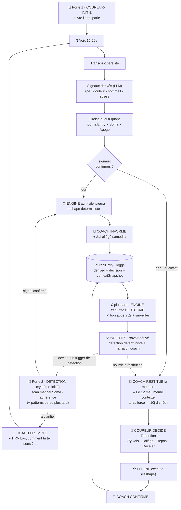

# Spec MVP — Le Journal Intelligent (le wedge de Cadence)

> **Statut** : spec produit, validé en conversation (2026-06-03). À transformer en issues.
> **Source** : `docs/Research Report.pdf` (analyse marché FR) + décisions de design ci-dessous.

---

## 1. Le wedge, en une phrase

> **La vision de l'Athlète du point de vue du Coach — qui s'améliore avec le temps, comprend de mieux en mieux, et devient pertinente grâce au croisement données qualitatives × données quantitatives.**

Le marché a saturé trois couches (génération de plan, prescription d'allures, tracking biométrique). Il a laissé vide une 4ᵉ : **la mémoire décisionnelle et qualitative du coureur**. Cadence a déjà les trois premières. Cette spec construit la 4ᵉ.

La boucle :

```
   CAPTURE  ──►  DÉRIVE  ──►  CROISE  ──►  RESTITUE  ──►  (le coureur décide)  ──┐
  voix 15s     signaux IA   qual × quant   insight +        et la décision        │
  (ressenti +  structurés   (Soma +        au bon moment    est loggée            │
   contexte)                Agoge)                                                │
      ▲                                                                           │
      └──────────────────  l'outcome revient étiqueter la décision  ◄─────────────┘
                            (= la douve : log décisionnel étiqueté-outcome)
```

---

## 2. Principes directeurs

1. **Le wedge est une couche, pas un écran.** Le tab « Coach » en est le cœur (synthèse), mais ses capillaires touchent Today, Calendar et Session detail.
2. **Voix d'abord, structure dérivée.** Le coureur parle 15-20 s. On transcrit, on **persiste le transcript**, un LLM extrait des signaux structurés. (⚠️ Rouvre la décision « voice-only sans transcription ».)
3. **Détection déterministe, narration LLM.** Les patterns sont détectés par des règles/stats reproductibles ; le coach les met en mots. Jamais d'insight inventé par le LLM. (Cohérent avec « Engine déterministe, coach raconte ».)
4. **Infra minimale viable.** Pas de machine à états, pas de tables superflues. Le registre des décisions est une *vue* sur plusieurs sources, pas une nouvelle table.
5. **Le coach parle en « je », jamais d'« Engine ».** Transparence sur demande. Décisionnel, pas culpabilisant.

---

## 3. Modèle de données (Convex)

> **Convention** : pas de champ `createdAt` — Convex fournit `_creationTime` sur toute table. On ne stocke que les timestamps *événementiels* distincts de la création (`surfacedAt`, `dismissedAt`, `outcome.filledAt`) et `dayKey` (ancrage jour-calendaire, ≠ instant de création).

### 3.1 `journalEntry` — la colonne vertébrale (absorbe `sessionFeedback`)

| Champ | Type | Note |
|---|---|---|
| `userId` | Id<users> | |
| `dayKey` | string | jour-calendaire ancré midi UTC (`ymdToUtcIso`) — clé de jointure Soma/Calendar |
| `kind` | `"post_session" \| "pre_session_decision" \| "spontaneous"` | |
| `workoutId?` | WorkoutDoc id (Agoge) | présent pour post/pre-session |
| `audioStorageId?` | Id<_storage> | |
| `durationMs?` | number | mesure de friction |
| `transcript?` | string | **persisté** (plus supprimé) |
| `transcriptLang?` | `"en" \| "fr"` | |
| `derived?` | objet (voir 3.2) | signaux structurés extraits par IA |
| `decision?` | objet (voir 3.3) | présent si l'entrée porte une décision du coureur |
| `outcome?` | objet (voir 3.4) | rempli plus tard par le job d'étiquetage |

### 3.2 `derived` — signaux qualitatifs structurés (extraits par LLM du transcript)

```
rpe?: number              // 0-10, effort perçu
painLocations?: { area: string; severity?: number }[]   // ex. [{area:"mollet droit", severity:4}]
sleepQuality?: "poor" | "ok" | "good"
lifeStress?: "low" | "med" | "high"
motivation?: "low" | "med" | "high"
effortFeel?: "easy" | "right" | "hard"
mood?: string
rawNotes?: string         // tout le reste, verbatim utile
```

Tous optionnels — le LLM ne remplit que ce que le coureur a mentionné. **Pas de gate code** : le LLM émet ce qu'il extrait, on stocke.

### 3.3 `decision` — la décision du coureur (le log décisionnel, brique 2 du wedge)

```
choice: "go" | "ease" | "rest" | "swap"
reason: string                    // le « pourquoi » du coureur, tiré du transcript
contextSnapshot: {                // état quantitatif AU MOMENT de la décision (reproductible)
  hrvZScore?: number
  sleepHoursLastNight?: number
  rhrToday?: number
  weekKeyDoneSoFar?: number
}
reshaped: boolean                 // l'Engine a-t-il modifié le plan suite à ce choix ?
interventionId?: Id<coachInterventions>  // lien si reshape (réutilise la machinerie existante)
```

### 3.4 `outcome` — l'étiquetage (la douve)

```
filledAt: number
verdict: "good_call" | "watch" | "bad_call"
metrics: {                        // signaux observés dans la fenêtre post-décision
  painPersisted?: boolean
  nextKeySessionCompleted?: boolean
  injuryFollowed?: boolean
}
```

### 3.5 `insight` — les patterns croisés (deux visages : narré + structuré)

Un insight n'est PAS qu'une carte à afficher. Il a une **face humaine** (`statement`, narrée) et une **face machine** (`pattern`, structurée) que trois consommateurs lisent : la **détection** (devient un trigger), la **génération de plan** (contrainte sur le prochain bloc), et la **restitution** du coach (contexte injecté). C'est ce qui ferme la boucle d'amélioration continue.

| Champ | Type | Note |
|---|---|---|
| `userId` | Id<users> | |
| `type` | `"sleep_quality" \| "pain_recurrence" \| "pacing" \| "load" \| ...` | détecteur qui l'a produit |
| `statement` | string | **face humaine** : texte narré dans la voix du coach |
| `pattern` | objet | **face machine** : `{ detector, subject?, trigger? }` ex. `{detector:"pain_recurrence", subject:"calf_right", trigger:{type:"schedule", value:"2_quality_within_3d"}}` |
| `evidence` | objet | `{ support: number; sample: number; detail: string }` ex. « 5 longues / 6 après 7h+ sommeil notées bonnes » |
| `dayKeys?` | string[] | jours sources (pour les marqueurs 💡 du Calendar) |
| `surfacedAt?` | number | quand montré à l'utilisateur |
| `dismissedAt?` | number | si écarté (pas de machine à états — juste deux timestamps) |
| `helpful?` | boolean | retour utilisateur (mesure le « moment aha ») |

> **Limite dure** : un insight ne mute JAMAIS le plan en cours en silence. Il alimente la détection (qui *prompte/prévient*), la *génération* du prochain bloc, et le contexte du coach. La mutation du plan vivant passe toujours par un signal confirmé (Engine) ou une décision du coureur — cf. [[feedback_no_plan_changes_on_uncertain_signals]].

### 3.6 Ce qu'on NE crée PAS

- Pas de table « decisions » : le **registre des décisions** du tab Coach est une vue qui unit `journalEntry.decision` (coureur) + `coachInterventions` (Engine, HRV) + `weeklyReviews` (Engine, hebdo).
- Pas de table « enriched join » : le croisement qual × quant est calculé à la lecture par le détecteur (jointure `journalEntry.dayKey` × Soma `dailySummary` × Agoge `workout`).

---

## 4. Le pipeline

### Capture → Dérive
1. Le coureur enregistre un vocal (15-20 s) — post-séance (Mark Done) ou pré-séance (« Pas sûr d'y aller ? »).
2. Action `transcribe` (Whisper, déjà existante) → transcript. **On ne supprime plus l'audio/transcript.**
3. Action `deriveSignals` : LLM extrait `derived` (3.2) depuis le transcript. Idempotent par entrée.
4. (Optionnel) 1-2 taps : carte du corps pour la douleur, molette RPE — pré-remplissent/corrigent `derived`.

### Croise
- À la lecture, jointure par `dayKey` : `journalEntry.derived` × Soma `dailySummary` (HRV, RHR, sommeil, body battery, stress) × Agoge `workout` (planifié vs réalisé, allure vs cible, complétion).

### Restitue
- **Insights** (pull) : le détecteur tourne (cron hebdo ou après N nouvelles entrées), produit des `insight`, le coach les narre.
- **Au moment décisif** (push) : sur Today, à la décision pré-séance, le coach récupère les décisions passées au contexte similaire et les restitue.

### Outcome (la douve)
- Job (au heartbeat hebdo existant) : reprend les `decision` dont la fenêtre d'outcome est écoulée, calcule `verdict` depuis les signaux observables, le coach narre le ✓/⚠.

---

## 4bis. Le modèle Restitue / Décide / Agit / Informe (les 3 acteurs)

Le wedge n'invente aucune nouvelle façon de muter le plan. Il s'emboîte dans la séparation existante :

| Acteur | Rôle | Règle |
|---|---|---|
| ⚙️ **Engine** | **AGIT** | seul à muter le plan ; toujours déterministe |
| 💬 **Coach** | **INFORME / RESTITUE** | read-only ; narre, ne touche pas au plan ; parle en « je » |
| 🏃 **Coureur** | **DÉCIDE** (dans l'ambiguïté) | choisit une *intention*, pas une édition libre |

**Décider ≠ Agir.** Décider = choisir l'intention. Agir = exécuter la mutation déterministe. Deux chemins selon la confiance des signaux :

- **Chemin A — signaux confirmés** (HRV bas, semaine close) : l'Engine décide *et* agit seul → le Coach informe → le coureur peut override (override = décision loggée). *(existe déjà aujourd'hui)*
- **Chemin B — signaux qualitatifs/incertains** (« mollet tendu, mal dormi ») : l'Engine n'agit pas sur l'incertain ([[feedback_no_plan_changes_on_uncertain_signals]]) → le Coach **restitue** la mémoire → le **coureur décide l'intention** → l'Engine **exécute** (calcule le reshape) → le Coach confirme → décision loggée. *(le moment héros du wedge)*

Point clé : dans le chemin B, le coureur choisit l'**intention** (« allège »), l'**Engine** traduit en reshape concret (combien, quelle séance). L'Engine reste maître des nombres ; le Coach n'invente jamais un plan.



> **Légende** : ⚙️ Engine (agit) · 💬 Coach (informe/restitue) · 🏃 Coureur (décide) · 🔎 Détection (amorce). **Deux portes d'entrée** : le coureur parle (1) ou le système détecte (2). La détection peut soit agir en silence (signal confirmé), soit *amorcer* la capture qualitative (prompt). En bas, l'`outcome` nourrit les `insight`, qui (a) enrichissent les restitutions futures et (b) **deviennent eux-mêmes des triggers de détection** — la boucle se referme sur elle-même : c'est la douve.

### La détection mûrit en 3 temps

| | Ce qu'elle regarde | Ce qu'elle fait |
|---|---|---|
| **v0 (aujourd'hui)** | seuils quantitatifs (HRV `hrv_low_v1`, adhérence weekly review) | agit en silence (reshape) |
| **v1 (wedge)** | mêmes signaux | **prompte** le qualitatif + restitue, au lieu d'agir muet |
| **v2 (douve)** | + **patterns perso issus des `insight`** | **prévient AVANT** que le pattern ne frappe |

La détection existe déjà (v0) — elle est juste quantitative et muette. Le wedge la rend *éliciteuse* (v1) puis *apprenante* (v2 : un `insight` comme « mollet droit ↔ 2 qualités en 3 jours » devient un trigger). C'est là que « Cadence détecte » prend son sens plein.

## 5. Les 4 surfaces + leurs points de contact

### 🏠 Today (`index`) — le wedge au moment de l'action
- **Lecture de l'instant** : la carte de la séance du jour porte une micro-lecture (`readinessNote`) dérivée de Soma + signaux récents, narrée par le coach (« Dormi 7h20, HRV ok — bonne fenêtre »). Bascule en prudence si signaux dégradés.
- **Entrée décision** : « Pas sûr d'y aller ? » → flow décision pré-séance :
  - vocal → transcribe → deriveSignals → coach lit Soma + récupère décisions similaires passées → recommande + propose `[J'y vais] [J'allège] [Repos] [Décaler]`
  - écrit `journalEntry(kind=pre_session_decision, decision)`
  - si ease/rest/swap → déclenche reshape Engine (réutilise `coachInterventions`), `decision.interventionId` posé.

### 📅 Calendar — l'histoire ressentie
- Chaque jour passé porte des **marqueurs mémoire** : point si `journalEntry`, icône si `decision`, 💡 si `insight` (query par plage de `dayKey`).
- Tap sur un jour passé → détail de l'entrée (ressenti, décision, outcome).

### Session detail — la boucle unitaire
- Mark Done enrichi : `recordForWorkout` persiste désormais transcript + déclenche deriveSignals.
- Restitue les `derived` (« tu as parlé de : mollet droit, fatigue »), l'insight croisé de cette séance, la décision + outcome s'il y en a eu.

### 🧠 Coach (fusion ancien Coach + Analytics) — la synthèse
Ordre à l'ouverture (**portrait d'abord, pas de boîte de chat**) :
1. **« Ce que j'ai appris sur toi »** — portrait évolutif (1ʳᵉ personne). Synthèse régénérée périodiquement à partir des `coachMemories` + signaux longitudinaux.
2. **Insights** (fresh d'abord) — cartes `insight`, avec retour 👍/👎 (`helpful`).
3. **Tes décisions** — registre unifié (vue §3.6), étiqueté outcome ✓/⚠.
4. **Courbes** (Analytics absorbé) — charge / VDOT / sommeil.
5. **« Pose-moi une question »** — chat préservé, en bas, contextuel.

---

## 6. Changements côté Coach (lecture du journal)

Aujourd'hui le coach **ne peut pas** lire `sessionFeedback`. On ajoute des read tools :
- `listJournalEntries(range)`, `getJournalEntry(id)`
- `listInsights()`, `listDecisions(range)`

→ débloque « il y a 3 semaines, dans un contexte similaire, tu as forcé et coupé 10 jours ». Le coach reste **read-only** sur le plan (l'Engine + l'UI éditent).

---

## 7. Le moteur d'insights — process (détection déterministe + narration)

Périodique (cron hebdo ou après N nouvelles entrées) :
1. **Assemble le dataset joint** : par jour/séance = `{derived, Soma daily (HRV/RHR/sommeil), Agoge (complétion, allure vs cible), decision+outcome}`.
2. **Passe la bibliothèque de détecteurs** (fonctions pures, testables), un par type de pattern. v1 :
   - `sleep_quality` : qualité de séance (complétion + RPE + allure vs cible) corrélée au sommeil.
   - `pain_recurrence` : récurrence d'une `painLocation` corrélée à un pattern de charge/planning.
   - `pacing` : départs trop rapides (allure début vs fin) — angoisse classique du primo-marathonien.
3. Chaque détecteur émet un candidat + `evidence{support, sample}` + le `pattern` structuré.
4. **Seuil de support** : N observations min avant d'émettre (pas d'insight sur 1 point).
5. **Dédup** contre les insights existants (incrémente le support si déjà connu — pas de doublon).
6. Le coach **narre** le `statement` (profil `narrate`, locale-aware).
7. Persiste + enregistre le `pattern` auprès de la détection (→ devient un trigger, v2).

> On démarre avec ~3 détecteurs ; la bibliothèque grossit. **Les insights ne sont pas magiques : c'est une bibliothèque de détecteurs seuillés sur une table jointe.**

**La boucle se referme** : l'insight (face `pattern`) nourrit ensuite (a) la détection proactive, (b) les contraintes de génération du prochain bloc, (c) le contexte de restitution du coach. Voir scénarios §12.

---

## 8. Étiquetage outcome — process (la douve défensive)

Au heartbeat hebdo (cron existant), pour chaque `decision` dont la fenêtre est close :
1. **Fenêtre d'outcome** : jusqu'à la prochaine séance clé, ou N jours (cf. §11).
2. **Récolte des signaux observables** dans la fenêtre :
   - la même `painLocation` réapparaît-elle dans une entrée suivante ? escalade-t-elle ?
   - la prochaine séance clé est-elle complétée (Agoge) ?
   - auto-miss / crash HRV / blessure (Soma + adhérence) ?
3. **Règles de verdict déterministes** :
   - `ease`/`rest` + douleur non-persistante + séance clé OK → `good_call`
   - `go` malgré alerte + douleur persiste/escalade OU blessure → `bad_call`
   - ambigu → `watch`
4. Écrit `outcome{verdict, metrics, filledAt}` ; le coach **narre** le ✓/⚠.

→ **Verdict = règles sur faits observables ; narration = LLM. Jamais de jugement LLM sur « était-ce un bon choix ».** Réutilise le pattern `outcomeMetrics` déjà réservé dans `coachInterventions`/`weeklyReviews`. **La valeur croît avec l'historique** → coût de changement que les concurrents « plan-first » n'ont pas.

---

## 8bis. Où apparaît la voix du coach (carte de restitution UI)

« Le coach parle » ≠ « un message dans le Chat ». Sa voix apparaît **là où vit la chose concernée** — c'est pourquoi le Chat nu semblait inutile. Le Chat n'est qu'**un canal parmi plusieurs**.

| Sortie du coach | Où on la voit |
|---|---|
| Prompt de détection (« HRV bas, comment tu te sens ? ») | push notif + carte en haut de **Today** |
| Inform action silencieuse (« J'ai allégé samedi ») | push notif (`notificationBody`) + la **séance modifiée** sur Today/Calendar (« allégée — HRV bas ») + ligne dans **« Tes décisions »** (tab Coach) |
| Restitution au moment décisif (« le 12 mai… ») | feuille **« Pas sûr d'y aller ? »** sur **Today** |
| Insights (pull) | feed du **tab Coach** + marqueurs 💡 sur **Calendar** |
| Réponse à une question libre | **Chat**, en bas du tab Coach |

→ « J'ai allégé samedi » se voit à **3 endroits** : la notif (le moment), la séance modifiée (l'artefact), le registre de décisions (l'historique).

---

## 9. Scénarios de bout en bout (le wedge complet)

**A — Le mollet : Qual×Quant → insight → trigger → détection proactive → outcome → amélioration du plan**
- *S2* : vocal post-fractionné « mollet droit un peu raide » → `derived{douleur: mollet D, léger}`. Loggé, pas d'action.
- *S3* : 2ᵉ qualité 2 j après, mollet re-signalé. Loggé.
- *Détecteur hebdo* : `pain_recurrence` → mollet D ↔ 2 qualités en ≤3 j (support 2). **Insight créé** (`statement` + `pattern`). Surfacé (tab Coach).
- *S5* : plan = VMA jeudi + tempo samedi. **Détection v2** matche le `pattern` AVANT → Today : « 2 qualités rapprochées — ton schéma à mollet. On espace ? » → coureur décide « espace » → **Engine déplace le tempo**. Loggé.
- *Outcome* : pas de douleur la semaine suivante → `good_call` → **support de l'insight ++**.
- *Bloc suivant* : la **génération** intègre « éviter 2 qualités en 3 j pour ce coureur ».

**B — Le sommeil : l'insight comme contexte structuré**
- 4 sem. de vocaux + sommeil Soma → détecteur `sleep_quality` : meilleures longues après 7h+ (5/6). Insight surfacé.
- *Amélioration continue* : check-in du matin, Soma = 5h → le coach **injecte l'insight comme contexte** : « Tu as dormi 5h ; tes longues sont plus dures comme ça — pars prudent sur l'allure. » L'insight n'est pas une carte morte, c'est du **contexte qui façonne l'interaction**.

**C — Le faux positif HRV : pourquoi Qual×Quant > Quant seul (le « problème Runna » évité)**
- Matin : HRV bas. *v0* aurait reshape en silence. *v1* : coach **prompte** « HRV bas, comment tu te sens ? » → « nickel, juste une soirée arrosée hier » → `derived{ressenti: bon, cause ponctuelle}`.
- *Croise* : HRV bas **mais** subjectif bon + cause one-off → coach restitue, **coureur décide « j'y vais »** → **l'Engine NE reshape PAS**.
- *Outcome* : séance réussie → `good_call` → apprend que **pour ce coureur**, un HRV bas isolé post-social n'est pas prédictif.
- → le qualitatif **corrige un faux positif quantitatif** — l'erreur de Runna (sortie d'algo traitée comme autorité), évitée.

---

## 10. Critères de validation (issus du rapport §5)

| Métrique | Seuil | Instrumentation |
|---|---|---|
| Saisie post-séance maintenue à S4 | **≥ 60 %** | taux de capture / utilisateur / semaine |
| Friction de saisie | **< 20 s** | `durationMs` + complétion |
| « Moment aha » avant J+21 | **≥ 40 %** « Cadence m'a appris qqch sur moi » | 1ᵉʳ `insight.surfacedAt` + `insight.helpful` 👍 |

Sous 60 % de saisie à S4 → re-designer la capture (plus de dérivation passive depuis la montre, moins de déclaratif) avant tout le reste. C'est le test de mort du wedge.

---

## 11. Découpage / MVP

**La destination est v2** (insight → trigger → détection proactive + contexte de génération de plan). C'est ça le wedge complet — sans la boucle de retour, on a un carnet intelligent, pas un coach-mémoire. P0→P5 est le chemin :

- **P0 — Fondation** : `journalEntry` spine ; Mark Done persiste transcript + deriveSignals ; coach lit le journal.
- **P1 — Capture des 2 moments** : flow décision pré-séance sur Today (+ log décisionnel coureur).
- **P2 — Croise + restitue** : 1+ détecteur d'insight (`statement` + `pattern`) ; refonte tab Coach (portrait + insights + décisions + analytics absorbé) ; carte de restitution §8bis.
- **P3 — Douve** : boucle d'étiquetage outcome (déterministe + narration).
- **P4 — Détection éliciteuse (v1)** : les triggers quantitatifs existants (HRV, adhérence) **promptent** le qualitatif au lieu d'agir muet.
- **P5 — Détection apprenante (v2)** : le `pattern` des insights devient un trigger + une contrainte de génération du prochain bloc. **La boucle se referme.**

Le MVP **livrable au test** (30-50 primo-marathoniens FR) = **P0+P1+P2** (au moins un insight croisé restitué — le rapport exige la restitution dès S2-S3). P3→P5 = la profondeur défensive, à construire une fois le wedge validé.

---

## 12. Risques & questions ouvertes

- **Qualité de l'extraction LLM** (`deriveSignals`) : si bruitée, les insights sont faux → prévoir correction par taps + seuil de support élevé.
- **Froideur de l'IA vs chaleur du coach humain** (caveat du rapport) : la narration et le portrait doivent être irréprochables de ton.
- **Cible plan = 5K aujourd'hui**, wedge = primo-marathonien. Le plan peut rester « suffisamment bon » ; à arbitrer hors de cette spec.
- **Fenêtre d'outcome** : combien de jours avant d'étiqueter une décision ? (proposer : prochaine séance clé, ou 10 j.)
- **RevenueCat / Pro** : la capture reste-t-elle Pro-gated, ou free-tier « journal seul » pour l'acquisition (piste du rapport) ?
